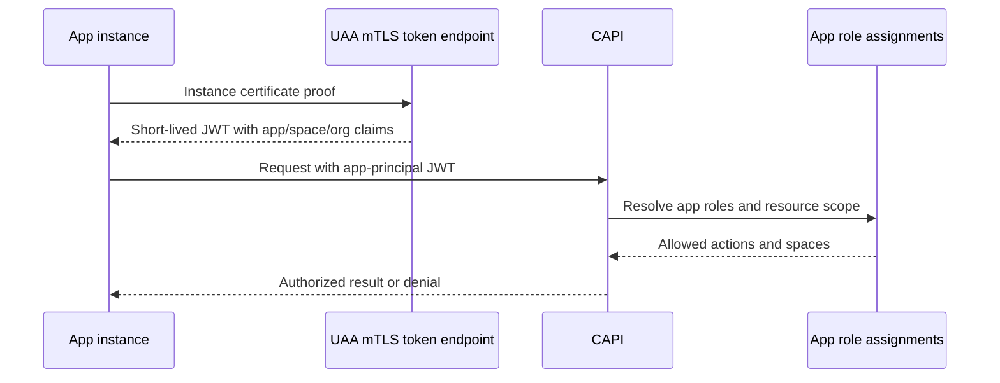

# Applications as CAPI principals

## The idea

Allow a Cloud Foundry application to act as a first-class CAPI principal with narrowly assigned
roles. A running app instance would prove its workload identity using its platform-issued instance
certificate and exchange that certificate for a short-lived JWT. CAPI would authorize the JWT as
the app principal rather than as a human user or a broadly privileged service client.

The open [UAA mTLS client-authentication PR](https://github.com/cloudfoundry/uaa/pull/3972)
demonstrates the first half of this flow: validating a CF instance identity certificate and issuing
a JWT containing verified `app_guid`, `space_guid`, `org_guid`, and `cf_instance_guid` claims.
This idea asks what CAPI should do with that identity.

An app might be granted a constrained capability such as creating sandboxes owned by itself in its
current space. A more powerful role could permit it to push or manage apps in explicitly assigned
spaces. The exact role vocabulary, assignment API, and policy model are intentionally left for
later design; the idea is to make app principals and their authorization relationships explicit in
CAPI rather than encoding them as shared client credentials.

## Why it might matter

Agent workloads increasingly need to create subordinate workloads, isolated sandboxes, tasks, or
other applications. Today those operations generally require user tokens or provisioned UAA
clients. Both approaches introduce credentials whose authority is detached from the lifecycle of
the calling app.

An app principal would let CAPI express least-privilege relationships directly. For the sandbox
case, CAPI could recognize that an app may create and manage only sandboxes owned by that same app
in its current space. Certificate rotation and short-lived JWTs would avoid distributing a static
CAPI secret to application code or compatibility sidecars.

## What to research next

- Is an app principal a new CAPI principal type, a synthetic user, or a separate authorization
  path?
- How are roles assigned and revoked, and which actors may grant an app authority over another
  space?
- Should app-scoped permissions be modeled as roles, relationships, entitlements, or resource
  capabilities?
- How does CAPI verify that JWT app/space/org claims still match current CAPI state after app moves,
  deletion, certificate theft, or rescheduling?
- Are roles attached to the app, a process, a revision, or a deployment?
- How are audit events attributed when any scaled instance of an app can exercise the same role?
- Which operations require request idempotency or additional delegation context?
- Can Tasks use this identity flow even though the current system-provided Envoy process is not
  enabled for Tasks?

## Related

- [[opensandbox-compatible-app-sidecar]] consumes an app-principal token without exposing it to
  OpenSandbox client libraries.
- [[platform-provided-opt-in-sidecars]] could host the certificate-to-JWT and compatibility logic.
- [[durable-capi-sandboxes]] is the first proposed app-owned resource.
- [[agent-identity-and-tool-authorization]] explores agent identities and delegated authority.
- [[credential-less-agent-processes]] explores platform-held credentials.
- [UAA PR #3972: mTLS client authentication using CF instance identity](https://github.com/cloudfoundry/uaa/pull/3972)
- [RFC-0055: Identity-Aware Routing for GoRouter](https://github.com/cloudfoundry/community/blob/main/toc/rfc/rfc-0055-identity-aware-routing-for-gorouter.md)
