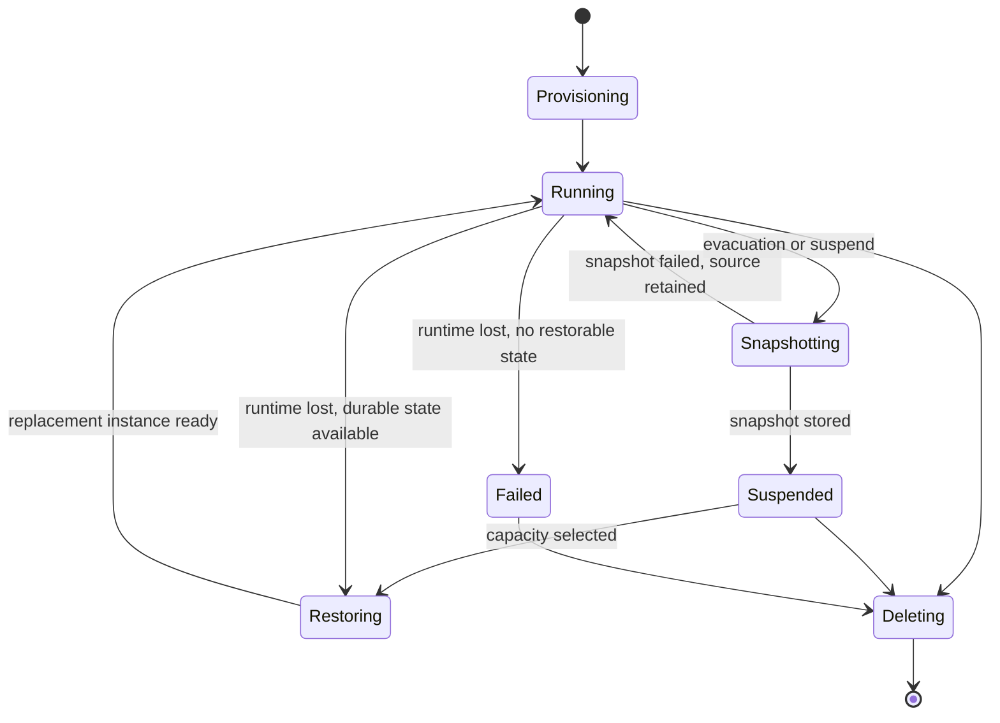

# Durable app-owned sandboxes in CAPI

## The idea

Add a durable `/v3/sandboxes` resource to CAPI. Each sandbox would be owned by an app GUID and,
through that app, scoped to a space and organization. The resource would be shared by every scaled
instance of the owning app and would survive app-instance restart, scaling, restage, and placement
changes.

CAPI would be the source of truth for sandbox identity, desired lifecycle state, ownership,
authorization, quotas, routes, route policies, and references to durable snapshot artifacts.
Ephemeral runtime instances on Diego cells would realize that desired state. This follows the
useful split already present in CF applications: durable desired state above replaceable runtime
instances. Unlike a Task, however, a sandbox would remain addressable and resumable across
individual executions.

For a planned host evacuation, the platform would snapshot sandbox filesystem state into blobstore
before starting the replacement elsewhere. The snapshot boundary is deliberately unresolved:

### Option A: defined workspace directory

Only a documented directory, such as `/workspace`, is durable.

- **Advantages:** smaller snapshots, clearer ownership, easier portability across stacks and
  runtimes, and fewer accidental captures of credentials, caches, or injected platform files.
- **Trade-offs:** applications and OpenSandbox-compatible clients must understand the durable
  directory contract; writes elsewhere are lost; existing workloads may assume arbitrary rootfs
  mutations survive.

### Option B: entire writable application rootfs

Capture the complete writable layer associated with the sandbox workload.

- **Advantages:** more transparent restoration and closer alignment with container-commit-style
  OpenSandbox implementations.
- **Trade-offs:** larger artifacts, stronger coupling to Garden/rootfs internals, uncertain
  portability across stack versions and cells, and greater risk of capturing transient or secret
  material. Mounted volumes and process memory would still need separate semantics.

### Option C: capability-based hybrid

Require a portable workspace profile and optionally advertise full-rootfs checkpoint support.

- **Advantages:** provides a common baseline without blocking richer runtimes.
- **Trade-offs:** creates multiple durability classes that clients must discover and test, and may
  reduce portability if workloads silently depend on the stronger class.

Unexpected host loss is distinct from planned evacuation. If no current snapshot exists, CAPI may
be able to recreate the sandbox from its base image and last durable workspace, but cannot claim to
preserve process memory or unsnapshotted filesystem state. The API should expose this difference
rather than treating all replacement as transparent migration.

## Why it might matter

Agent workloads need isolated, addressable execution environments that can outlive one app request
or one cell placement. Existing CF Tasks are run-to-completion and fail when their cell disappears;
ordinary LRPs restart from desired application state and lose local writable state. Neither is a
durable sandbox identity with explicit suspend, restore, and endpoint semantics.

A CAPI resource would make app/space ownership and lifecycle authoritative in the same control
plane that already governs applications. It would also provide a stable backend for an
OpenSandbox-compatible localhost facade without requiring OpenSandbox itself to understand CF
orgs, spaces, roles, blobstores, or Diego placement.

## What to research next

- Which lifecycle states and operations belong in the first CAPI API?
- Which snapshot option should be the portable baseline, and what consistency guarantee is
  practical while the sandbox is running?
- Does evacuation stop new `execd` operations before snapshotting, and how are in-flight commands
  completed, cancelled, or reported as ambiguous?
- What artifact format permits restoration across cells, stack updates, and Garden versions?
- How are blobstore retention, encryption, quotas, garbage collection, and ownership enforced?
- Are mounted volumes excluded from snapshots and remounted independently?
- Is process-memory checkpointing an optional future capability or explicitly outside the CAPI
  sandbox contract?
- What happens when an unexpected cell loss occurs after the previous snapshot but before the next
  one?
- How are logical routes and app-identity route policies rebound to a replacement runtime without
  exposing stale endpoints?
- Should app deletion cascade sandbox deletion, and should app restage preserve all sandboxes?

## Related

- [[opensandbox-compatible-app-sidecar]] exposes these resources through the OpenSandbox API.
- [[platform-provided-opt-in-sidecars]] provides the local compatibility process.
- [[applications-as-capi-principals]] authorizes the owning app to manage its sandboxes.
- [[per-session-sandboxes]] introduces sandbox lifecycle states and blobstore checkpointing.
- [[durable-tasks-for-cf]] separates durable identity from ephemeral compute slices.
- [[agent-failure-checkpointing]] explores broader agent checkpoint semantics.
- [OpenSandbox](https://github.com/opensandbox-group/OpenSandbox)
- [Kubernetes Agent Sandbox](https://github.com/kubernetes-sigs/agent-sandbox)
