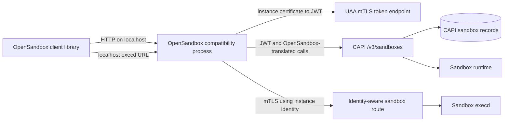

# OpenSandbox-compatible application sidecar

## The idea

Offer an optional, platform-provided process that exposes an
[OpenSandbox-compatible](https://github.com/opensandbox-group/OpenSandbox) API on localhost to
each opted-in Cloud Foundry application instance. Existing OpenSandbox client libraries could
then create and use sandboxes without understanding UAA, CAPI, orgs and spaces, application
instance certificates, or mTLS route policies.

The process would be a stateless compatibility facade. CAPI would remain the source of truth for
all sandboxes owned by an app, so every scaled instance of that app would see the same sandbox
collection through its local facade. The facade would translate OpenSandbox lifecycle requests
to a proposed CAPI `/v3/sandboxes` API and translate the responses back to the OpenSandbox
contract.

For data-plane access, the facade could return localhost URLs when an OpenSandbox client asks for
an `execd` endpoint. Requests to those URLs would be proxied to the sandbox's protected route,
with the facade originating mTLS using the calling application instance's platform-issued
certificate. This is transport adaptation rather than an additional security boundary: the goal
is to keep every OpenSandbox language client unaware of CF-specific authentication and routing.

The process would hold no authoritative sandbox records. Local token and endpoint caches could be
short-lived optimizations, but a restart or scale-out event would reconstruct all state from CAPI.
Sandbox ownership would be the app GUID rather than the individual app instance, matching the way
all instances share an app's desired state.

## Why it might matter

OpenSandbox publishes client libraries in several languages, but its current lifecycle
authentication and tenancy model does not map directly onto UAA and CF org/space authorization.
Changing every client to understand OAuth refresh, CF workload identity, app ownership, and mTLS
would create a CF-specific fork of otherwise portable clients.

A localhost facade preserves the OpenSandbox developer experience while allowing Cloud Foundry to
remain authoritative for ownership, quotas, authorization, placement, routing, and durability.
It also gives CF room to expose a well-defined compatible subset while the OpenSandbox lifecycle
contract is still pre-v1 and does not fully define durability, evacuation, or retry semantics.

## What to research next

- Which OpenSandbox lifecycle and `execd` operations form the initial compatibility profile?
- Can the facade use the proposed
  [UAA mTLS client-authentication flow](https://github.com/cloudfoundry/uaa/pull/3972) directly,
  or should token exchange be mediated by another local platform process?
- How should the facade discover its owning app and the CAPI endpoint without accepting
  caller-controlled org, space, or app identifiers?
- How should it represent CAPI capabilities that OpenSandbox does not specify, and vice versa?
- What retry rules avoid duplicate command execution when an `execd` stream is interrupted?
- Can identity-aware route policies authorize the owning app while keeping sandbox routes
  unreachable to other apps and external clients?
- Should one platform process expose several compatibility APIs, or should the OpenSandbox facade
  remain independently selectable and upgradeable?

## Related

- [[platform-provided-opt-in-sidecars]] provides the general CAPI/Diego injection mechanism.
- [[applications-as-capi-principals]] supplies workload authentication and app-scoped roles.
- [[durable-capi-sandboxes]] defines the authoritative resources behind the facade.
- [[credential-less-agent-processes]] and [[localhost-only-egress-for-agents]] explore adjacent
  localhost proxy patterns.
- [[per-session-sandboxes]] explores sandbox lifecycle states and suspension.
- [OpenSandbox AAIF project proposal](https://github.com/aaif/project-proposals/issues/26)
- [UAA PR #3972: mTLS client authentication using CF instance identity](https://github.com/cloudfoundry/uaa/pull/3972)
