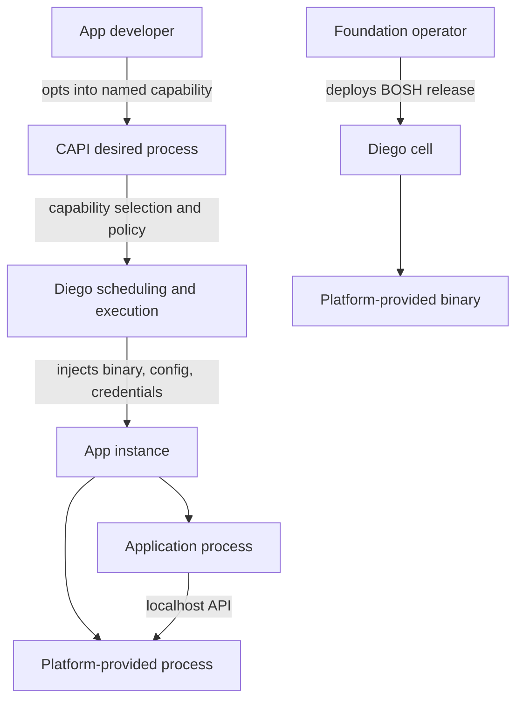

# Platform-provided opt-in application sidecars

## The idea

Introduce a general Cloud Foundry capability for applications to opt into sidecar-like processes
provided and managed by the platform. These processes would not be supplied as application-owned
container images. Their binaries would be packaged in BOSH releases and injected through CAPI and
Diego, following the broad precedent of the system-provided Envoy process used for routable LRPs.

An application would declare a named capability, such as `sandbox-api`, rather than an image,
command, or binary path. CAPI would validate operator policy and record the selection. Diego would
stage or mount the operator-controlled binary and configuration, account for its resources, start
it with the app instance, monitor its health, and provide only the platform credentials required
for that capability.

The exact manifest surface, BOSH packaging convention, and CAPI/Diego integration are deliberately
left open. The core idea is a supported platform extension point whose lifecycle and supply chain
are controlled by foundation operators rather than by application developers.

## Why it might matter

Several emerging agentic-runtime ideas need trusted local helpers: an OpenSandbox compatibility
facade, credential-less access to external services, mandatory egress policy, telemetry relays,
or workload-identity token exchange. Requiring each app to package these components creates
version drift and gives application code control over processes intended to enforce or simplify
platform behavior.

Cloud Foundry already injects platform-owned behavior into application instances, but there is no
general, app-selectable model for adding such processes. A first-class capability could make these
extensions consistent in placement, upgrades, health management, resource accounting, and
credential access.

## What to research next

- Where should capability opt-in live: app features, process configuration, metadata, bindings, or
  a new CAPI relationship?
- How should BOSH releases publish compatible binaries and configuration for CAPI and Diego?
- How are CPU, memory, disk, ports, startup ordering, health, and failure policy represented?
- Can capabilities be enabled or forbidden by organization, space, isolation segment, stack, or
  foundation policy?
- What compatibility contract lets operators upgrade a platform process independently of apps?
- How does the design support multiple stacks and Windows without pretending one binary format is
  universal?
- Which credentials may be mounted only into the platform process, given that some current CF
  instance credentials are also visible to the app container?
- Should selected capabilities share one process or remain separate processes with narrow duties?

## Related

- [[opensandbox-compatible-app-sidecar]] is the motivating first consumer.
- [[applications-as-capi-principals]] describes platform-issued identities and app permissions.
- [[durable-capi-sandboxes]] supplies the resource managed by the sandbox facade.
- [[credential-less-agent-processes]] proposes a localhost credential proxy.
- [[localhost-only-egress-for-agents]] proposes a platform-owned egress enforcement point.
- [[dapr-durable-execution-on-cf]] discusses a system-provided process rather than an
  application-owned Dapr sidecar.
- [Diego Envoy proxy configuration](https://github.com/cloudfoundry/diego-release/blob/develop/docs/060-envoy-proxy-configuration.md)
