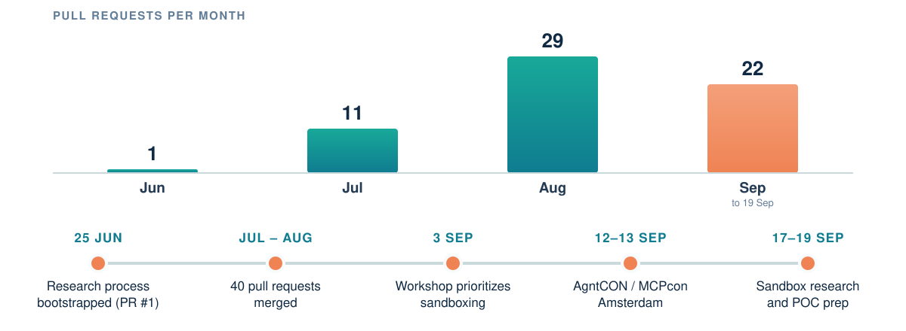
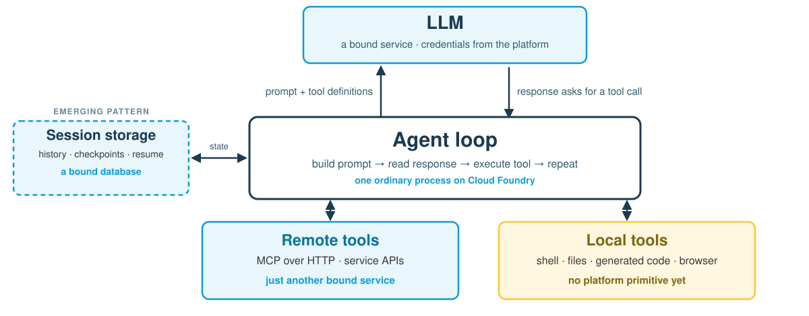
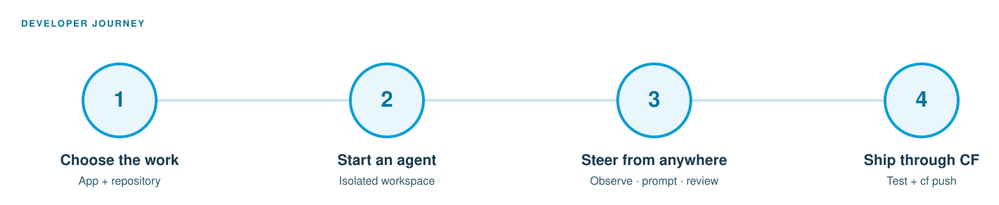

<!-- _class: title -->
# Agentic Runtime
## From research to sandboxing POCs

**Working Group update**  ·  Cloud Foundry Summit 2026

<!--
We started by asking a broad question: what does Cloud Foundry need to make
agentic workloads first-class? In a few months, the group has moved from
open-ended research to a first practical boundary: sandboxing.
-->

---

The mission

# Make agents feel native

The Agentic Runtime Working Group is exploring how AI agents and LLM-powered
workloads can be **deployed, managed, secured, scaled, and observed** with
Cloud Foundry's platform primitives.

<strong>Not a product roadmap yet.</strong> We are building shared context before we build a settled answer.

<!--
This is a working group, not a team arriving with a finished architecture.
The first phase is intentionally broad: bring in ideas, research the wider
ecosystem, and let the themes emerge from what people contribute.
-->

---

Momentum

# Research to POCs

Repository snapshot, 20 Sep 2026 · 63 PRs total · 43 merged · 20 open · 3 open issues · github.com/cloudfoundry/agentic-runtime-notes

<!--
The shape is the story. One pull request in June became eleven in July,
twenty-nine in August, and twenty-two so far in September. The repository
snapshot is 63 PRs: 43 merged and 20 open. The workshop turned that activity
into a priority: sandboxing first, with a Summit POC target.
-->

---

The workshop output

# Seven clusters. One first move.

  
<b>01</b> Sandboxing

  
<b>02</b> Identity & credentials

  
<b>03</b> Observability / OTel

  
<b>04</b> MCP facilitation

  
<b>05</b> Agent ↔ app communication

  
<b>06</b> Agentic buildpacks

  
<b>07</b> Durable workloads

The themes emerged from contributions. The order is where we chose to start.

<!--
The group clustered the material and agreed an order. Sandboxing came first,
then identity and credentials, observability, MCP, agent-to-app communication,
buildpacks, and durable workloads. This is a sequence for exploration, not a
claim that the platform has seven final feature areas.
-->

---

A shared model

# What is an agentic workload?

Every arrow here is a network call to a bound service — <em>except the bottom right one</em>.

<!--
Mechanically an agent is not exotic. //

There is one process running a loop.
It builds a prompt, and sends it to a model.
The model is reached over the network, with credentials.
That is a service binding. //

The model cannot do anything by itself.
It answers with text that says: please call this tool.
The agent loop is what actually executes that call,
and feeds the result back into the next prompt. //

Many of those tools are remote too — MCP over HTTP, or a plain API.
Also a binding. //

The loop also has to remember. Conversation history, checkpoints,
enough state to resume a run that was interrupted.
Some harnesses are starting to keep that in a database
instead of in memory or on local disk.
When they do, that is a binding as well. //

So look at the picture. Model: binding. Session state: binding.
Remote tools: binding. Loop: a process. //

Everything is a network call to a bound service.
Except the box on the bottom right.
-->

---

The bridge

# Agents are 12-factor apps

| Twelve-factor concern | In an agent | On Cloud Foundry today |
| --- | --- | --- |
| Backing service | the LLM endpoint | service binding |
| Backing service | remote MCP tools | binding or route |
| Backing service | session and run state | database binding |
| Config | model, keys, limits | env and `VCAP_SERVICES` |
| Processes | the agent loop | an ordinary app process |
| Disposability | resume or retry a run | restart, scale, health checks |
| Execution | local tools: shell, files, code | no primitive yet |

Six of these we already know how to run. The seventh is why the group started with sandboxing.

<!--
So let's be concrete about that claim. //

Take the twelve-factor checklist we already apply to every app on this platform.

The model endpoint is a backing service. We bind to it.
Remote MCP tools are backing services. We bind to those too.
Session and run state belongs in a database, which is another binding.
Model choice, keys and limits are config, from the environment.
The agent loop is just a process.
And a run that can be retried or resumed is ordinary disposability. //

Six out of seven are solved problems. We have been doing them for a decade. //

The last row is the one with nothing in the right-hand column.
Local execution. Shell, files, generated code.
There is no platform primitive for it. //

That single gap is the whole reason sandboxing came first.
-->

---

The first platform boundary

# Local execution breaks the model

  
Agent

→

  
Local machine

→

  
Files

<ul>
  <li>Which identity is acting?</li>
  <li>Which credentials and network paths are available?</li>
  <li>What gets isolated, observed, stopped, or cleaned up?</li>
</ul>

<blockquote>To make the tool cloud-native, make execution an explicit managed boundary.</blockquote>

<!--
Once the tool can execute locally, the platform has to answer new questions:
whose identity is acting, which credentials it can see, where it can connect,
and how we stop and observe it. The answer cannot be an invisible process on
some host. Execution needs to become an explicit boundary.
-->

---

Why sandboxing first

# A sandbox makes the boundary real

  
Agent

→

  
Exec service

→

  
Isolated work

  
<b>Isolate</b>processes and files

  
<b>Govern</b>identity and policy

  
<b>Observe</b>actions and output

  
<b>Manage</b>lifecycle and cleanup

OpenSandbox research: PR #57 · AAIF project proposal #26 (open proposal, not an adopted architecture)

<!--
That is why sandboxing is the first POC focus. A sandbox or exec service gives
the local-looking action a boundary the platform can govern. We researched
OpenSandbox as useful prior art. It is linked to an open AAIF project proposal,
not presented here as an adopted AAIF project or as our chosen architecture.
-->

---

A conversation with the POC leads

# Demo placeholder

Developer journey from the CF Herdr POC — one implementation under discussion, not an adopted architecture.

The point of the demo: make the execution boundary tangible.

<!--
This slide is intentionally a placeholder. We will choose the scenario with
the other leads. //

What the demo should show is the developer experience, not an architecture.
Choose the work. Start an agent in its own workspace.
Steer it from anywhere — observe, prompt, review.
Then ship the result through Cloud Foundry like any other change. //

This journey is taken from the CF Herdr POC. It is one implementation,
shown to make the boundary tangible. It is not a working group decision,
and the scenario itself is still open.
-->

---

Join the next phase

# Bring a question. Test a boundary.

<ul>
  <li>Help test and shape the sandboxing POCs.</li>
  <li>Add research or an idea for the next clusters.</li>
  <li>Connect the work across Cloud Foundry, MCP, and AAIF communities.</li>
</ul>

<blockquote>Build the concrete thing early. Keep the answer open long enough for the community to improve it.</blockquote>

<strong>cloudfoundry.github.io/agentic-runtime-notes</strong>

<!--
The ask is participation: help us test the sandboxing POCs, add research for
the next clusters, and continue the cross-foundation conversation. We have
enough momentum to make the question concrete, but not enough certainty to
pretend the answer is settled.
-->
